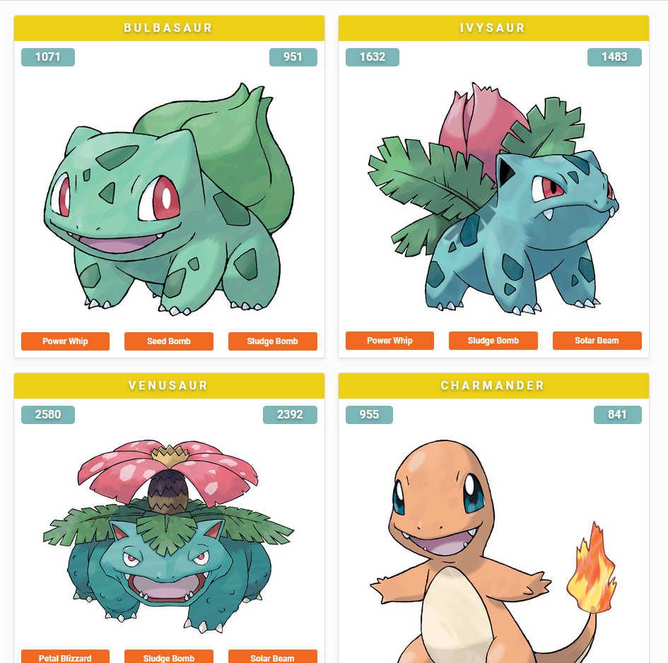

  

<h1 align="center">Pokémon</h1>

Pokémon reactjs and graphql  

## Setup

-   yarn create react-app pokemon-react-graphql

## Install Frontend Dependencies

-   yarn add @apollo/react-hooks
-   yarn add apollo-boost
-   yarn add graphql
-   yarn add graphql-tag

## API

-   https://github.com/lucasbento/graphql-pokemon
-   git clone https://github.com/lucasbento/graphql-pokemon.git
-   cd graphql-pokemon
-   yarn install
-   yarn run watch # Using nodemon for auto-reloading
-   API is deployed here locally >>>> http://localhost:5000

## Start

-   pokemon-react-graphql> yarn start
